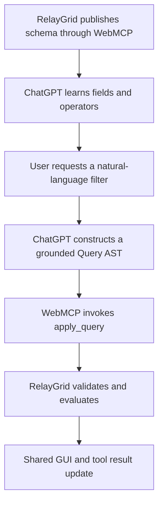

# RelayGrid

**Give any enterprise data grid an agent interface.**

> **RelayGrid turns complex enterprise worklists into a shared human-agent control surface: ChatGPT builds a schema-grounded query, while the application deterministically filters, previews, executes, audits, and reverses actions in the same live interface.**

RelayGrid is a WebMCP-enabled enterprise worklist demonstrating how a human and an agent can safely find, understand, preview, and act on complex records in the same live interface. The demo uses 7,500 fully synthetic radiology records; the architecture is domain-neutral.

**Public demo video:** https://youtu.be/N6PoXEHrVbA

## Why WebMCP

Enterprise tables expose important capabilities through dense, multi-step interfaces. RelayGrid registers structured tools directly in the page with `document.modelContext.registerTool()`. The tools operate on the same state the human sees:

> Find → Understand → Preview → Confirm → Act → Audit / Undo

WebMCP contributes before, during, and after the query call. It publishes the grid's real field names, supported operators, tool input schema, and live context. ChatGPT uses that contract to construct a grounded Query AST; WebMCP then invokes `apply_query`, and RelayGrid validates and evaluates it deterministically.



| Component    | Responsibility                                                      |
| ------------ | ------------------------------------------------------------------- |
| WebMCP       | Publishes the real schema and tools; carries calls and results.     |
| ChatGPT      | Interprets the request and constructs the AST within that contract. |
| RelayGrid    | Validates, runs, and stores the active query.                       |
| Query engine | Deterministically decides which records match.                      |
| GUI          | Displays the same query, results, Preview, and audit state.         |

## Tools

| Tool                   | Purpose                                                                          |
| ---------------------- | -------------------------------------------------------------------------------- |
| `describe_grid`        | Schema, operators, actions, current query, and visible state.                    |
| `apply_query`          | Validated nested AND/OR/NOT query AST.                                           |
| `explain_record`       | Conditions that selected one record.                                             |
| `preview_batch_action` | Conditional actions for the current visible batch (maximum 50) without mutation. |
| `execute_batch_action` | Execution of that saved visible-batch plan only after human confirmation.        |
| `undo_last_batch`      | Reverses the latest batch.                                                       |

## Safety

- Matching is deterministic; the agent supplies structured intent but does not decide matches.
- Invalid fields, operators, and empty groups are rejected.
- The workflow is stage-aware: filter first, then explain or Preview, then explicitly confirm execution; Undo becomes available only after execution.
- Commands used in the wrong stage return a specific error and make no changes.
- Gibberish and unsupported requests are not converted into invented filters or actions.
- High-impact actions require preview and explicit confirmation.
- Filtering covers the complete result set, while actions are safely limited to the current visible batch of at most 50 records.
- After execution, the active query remains in place and the next eligible batch fills the table automatically.
- `Approved` and `Cancelled` records are protected; warnings prevent direct approval of `Pending` records until review.
- Every execution creates a reversible audit entry.
- All demo data is synthetic.

## Guided judge flow

The live site keeps the worklist visible and places a compact, sticky **Judge Demo Guide** in the right workspace panel. The **Main scenario** tab is selected by default and presents **Filter → Verify → Approve → Next batch → Undo**. Separate **Review → Approve**, **Cancel → Undo**, and **Negative test** tabs show one independent scenario at a time. Only the current step expands to show its prompt and exact expected result; completed steps collapse into green checks and future steps remain as short gray titles. Immediately after every filter, **Verify one result** explains why the first visible record satisfies the active Query AST. Judges enter the prompts in the main ChatGPT conversation while the grid remains visible.

Each optional scenario begins with a query that replaces the previous active filter. **Reset session** is optional while running one scenario and should not be used during that scenario. When the judge switches to another independent scenario after creating query, Preview, selection, audit, notice, or guide-progress state, RelayGrid shows **Reset & start this scenario** inside the selected tab. The judge should click it before sending the new scenario's first prompt, especially if the previous scenario executed a batch action. Reset restores the original synthetic dataset and deterministic starting state; the prompt stays hidden in a clean session.

All four scenario tabs and both Reset controls communicate interactivity with a hand cursor, hover and keyboard-focus feedback, and descriptive hints. The primary **Reset session** control is always clickable and explains the clean state when no reset is needed. The contextual **Reset & start this scenario** control is shown only when prior session state exists and the judge changes scenarios.

The optional action scenarios deliberately use different multi-column queries: Review combines `CT OR MRI`, `warning OR follow-up`, a 14-day range, `NOT urgent`, and sorting; Cancel combines `X-Ray OR Ultrasound`, routine priority, a 7-day range, excluded flags, and sorting. This demonstrates that the generic Query AST is not tied to one canned filter.

Every expanded current-step card uses the same readable structure: numbered step, meaningful clinical title, full-width **Copy to chat** button, prompt text, and a specific expected result for that exact step. No scenario relies on a single generic outcome at the bottom. Titles describe what the judge is asking to see—such as **Show warning and follow-up cases**, **Preview sending cases to review**, **Approve the reviewed cases**, and **Restore the cancelled results**—instead of using technical filter labels. Every scenario also states the capability being demonstrated.

When a Preview exists, its live action, batch size, changed count, and unchanged count appear at the top of the guide beside the visible grid. The detailed confirmation card remains available in the same right workspace.

Progress is driven by successful WebMCP tool calls, not by copying a prompt. In every scenario, completed steps receive a green check, the next valid step is highlighted in blue, future steps remain gray, and the header shows the exact completed-step count. Reset clears both application state and guide progress.

Before the first request, the right panel contains only **No active agent query** and its guided-start instructions. Once work begins, that start card disappears and **Agent interpretation** plus **Current workflow state** appear. **Audit history** remains hidden until an action is actually executed.

1. Filter the complete worklist
2. Verify why one visible record matched
3. Preview the current visible batch
4. Confirm and execute that batch
5. Preview the next batch with the same action
6. Undo the latest executed batch

## Run and test

For the exact prompts, valid commands by stage, transition table, and expected results, see [JUDGE_TESTING.md](JUDGE_TESTING.md). See [QA_RESULTS.md](QA_RESULTS.md) for the verified regression and browser checks.

All four guided scenarios have been verified against the published site with native Chrome WebMCP: all six tools were discovered through `document.modelContext.getTools()` and invoked through `document.modelContext.executeTool()`. The full calls and deterministic results are documented in [QA_RESULTS.md](QA_RESULTS.md).

The published site and this repository are public. Viewing or judging RelayGrid requires no deploy key, access token, or private repository permission.

Requires Node.js 22.13 or newer.

```bash
npm ci
npm run dev
npm run lint
node --import tsx --test tests/query-engine.test.ts
npm run build
```

## Architecture

- `app/smart-grid-app.tsx` — shared UI state, WebMCP tools, actions, audit, and undo.
- `lib/smart-grid.ts` — data generator, AST, validation, evaluator, sorting, and explanations.
- `tests/query-engine.test.ts` — query and validation regression tests.

Licensed under MIT.
